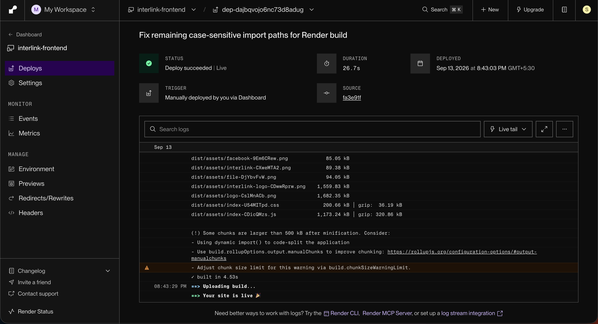
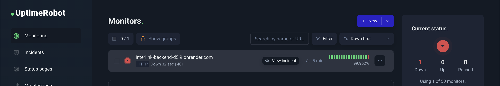

# The Jar File That Never Existed

**Interlink**

*What deploying a real, graded, five-person group project taught me that years of coursework never did.*

Somewhere in an earlier branch of our repository, there's a Dockerfile with this line in it:

```dockerfile
COPY target/demo-0.0.1-SNAPSHOT.jar app.jar
```

One line. Looks harmless. It's the reason our first attempt at hosting this project never had a chance.

That file, `target/demo-0.0.1-SNAPSHOT.jar`, never existed anywhere Render could see it. Not because someone deleted it. Not because of a typo. It never existed *on GitHub at all*. Our `.gitignore` excluded it, the way every Java project's `.gitignore` excludes a build folder, and nobody had ever committed a compiled jar to version control. So when Render tried to clone the repository and build that Dockerfile, it hit that `COPY` line and reached for a file that, as far as it was concerned, had never been born.

Here's the part that actually interests me though: that Dockerfile wasn't a dumb mistake, and I don't think it deserves to be treated like one. It was the obviously correct first instinct. Whoever wrote it already had a working jar sitting right there after building the project normally, so copying it into a container is the shortest possible path from "I have a compiled app" to "I have a container that runs it." It built. It ran. Nothing about testing it locally would ever have hinted that anything was wrong, because on the machine that built it, nothing was. We only found out it was wrong the same way most teams find out: months later, the first time somebody other than the original author tried to build that exact image somewhere else, and it fell over on a line nobody had looked at twice.

That, it turns out, was the theme of the entire project.

## What we were actually trying to ship

Interlink is a recruitment platform five of us built as a graded university project: a Spring Boot 3.4.4 backend running on Java 21, a React 19 frontend built with Vite, and Supabase underneath handling Postgres, authentication, and file storage. It had run locally for months, on five different laptops, a mix of Mac and Windows. Everyone's `mvn spring-boot:run` worked. Everyone's `npm run dev` worked. The demo videos looked great.

Nobody had put it on the actual internet yet.

## Why this needed a container before it needed anything else

If you've deployed a Node or Python app before, "just push it to a host" feels close to literal. Render, the platform we ended up on, has native support for Node, Python, Ruby, Go, Rust, and Elixir; point it at a repo and it figures out how to build and run your app on its own.

Java isn't on that list. Render's own documentation is blunt about it: to run "virtually any" other language, PHP, .NET, Java, you hand it a Docker image and it runs that instead. There's no shortcut. A Spring Boot app doesn't get to skip the container step the way a lot of other stacks do. So before we could think about environment variables, CORS, or any of the actual application logic, we had to think about Docker, not as an optional nicety, but as the only door in.

Render itself wasn't a random pick either. For a student project with no budget and no operations team, the two things that actually mattered were whether the free tier was genuinely free (not a trial credit with an expiry date) and whether the platform was going to still be around, and still behaving the same way, a month from now. Render's free tier is neither a trial nor a gimmick, it's a permanent offering with clearly published limits, and the platform itself has been stable and well documented for long enough that we weren't gambling on it disappearing mid-semester. Reliable, here, didn't mean "never requires any effort", it meant "behaves predictably enough that the effort you put in stays solved."

## The jar that wasn't there, and why it fooled everyone

Here's the thing about `COPY target/demo-0.0.1-SNAPSHOT.jar app.jar`: Docker doesn't know or care what your `.gitignore` says. When you run `docker build` on your own machine, Docker looks at whatever files happen to be sitting on your disk at that exact moment. If you'd just run `mvn package` a minute earlier, the jar is right there in `target/`, gitignored or not, and the build sails through.

The failure only shows up the moment somebody *else* builds the image, somebody who never ran `mvn package` first, because they're working from a fresh `git clone` where `target/` was never pushed in the first place. Which is exactly what a hosting platform does. Render doesn't inherit your local build artifacts. It gets your source code and nothing else, and it's supposed to turn that into a running app entirely on its own.

The fix wasn't complicated once we understood the actual problem, we just had to stop assuming the jar would be handed to us and build it ourselves, inside the container, every time:

```dockerfile
# Stage 1: build the jar from source, inside the container
FROM maven:3.9-eclipse-temurin-21 AS build
WORKDIR /build
COPY pom.xml .
RUN mvn -B dependency:go-offline
COPY src ./src
RUN mvn -B clean package -DskipTests

# Stage 2: throw the build tools away, ship only the result
FROM eclipse-temurin:21-jre
WORKDIR /app
COPY --from=build /build/target/*.jar app.jar
EXPOSE 8080
ENTRYPOINT ["java", "-XX:MaxRAMPercentage=75.0", "-jar", "app.jar"]
```

Two stages. The first has the full Maven toolchain and does nothing but compile. The second starts over from a much smaller image that only has a JRE installed, and copies across just the finished jar. Nothing about the final image depends on what state anyone's laptop happens to be in. That's the whole difference between "it works" and "it's actually deployable": whether the build depends on a machine, or on nothing at all.

## Then the same lesson showed up four more times

Once the container itself was solid, I assumed the hard part was over. It wasn't. What followed was a string of failures that had nothing to do with logic being wrong, and everything to do with something being quietly, invisibly true on my machine and nowhere else.

**The password that was right and wrong at the same time.** The container came up and immediately died: `FATAL: password authentication failed for user "postgres"`. I checked the `.env` file. I checked what Docker was reading. Everything *looked* consistent. It wasn't: on macOS, Terminal and IntelliJ don't necessarily agree on what a variable named `DB_PASSWORD` actually equals, because IntelliJ's Run Configuration keeps its own environment, separate from whatever your shell exports. The `.env` file and IntelliJ each held a different value, and there was no way to tell which one was still correct just by reading either file, only by comparing them side by side.

**The keys that only existed in one person's head, sort of.** Startup crashed again, this time with a Spring `PlaceholderResolutionException`, because `.env` was missing two variables entirely: `SERVICE_KEY` and `OPENAPI_KEY`. They'd never been written to a file anywhere. They only existed inside IntelliJ's manually configured run settings, which is a perfectly normal way to develop locally and a completely invisible way to fail in Docker.

**The bug that only exists on Linux.** This is the one that actually taught me something. Render's build started failing, repeatedly, on lines like:

```
Could not resolve './pages/CAPages/ShortlistedCandidates'
```

The folder was really named `CApages`. Lowercase `p`. And this is the detail that actually got me: it wasn't just a Mac thing. Our team runs a mix of Mac and Windows laptops, and the project built and ran fine on all of them, which makes sense once you know that macOS's default filesystem and Windows' default filesystem are both case-insensitive, they treat `CAPages` and `CApages` as identical names. Five different machines, two different operating systems, and not one of them was ever going to catch this, because none of them work the way Linux does. Linux is case-sensitive by default, and Render's build servers run Linux. The bug wasn't hiding because anyone was careless. It was hiding because every machine we'd ever tested on happened to share the one blind spot that Render doesn't have. I fixed that one, redeployed, and got an almost identical failure two minutes later on a different file. Then another. I was three failed builds into what was clearly not an isolated typo, it was a pattern, and continuing to fix these one at a time through Render's own build pipeline meant a multi-minute round trip for every single guess.

So I stopped guessing against Render and built a disposable Linux environment locally instead, matching Render's actual platform, and ran the real build there until it stopped complaining. That one afternoon surfaced twelve mismatched import paths across the project in a single pass: `AuthContext` versus the real file, `Authcontext.jsx`, `ChatBot.png` versus `Chatbot.png`, `ScoreCardManager` versus `ScorecardManager`, and more. None of it was carelessness. It's just that a case-insensitive filesystem will happily let a small inconsistency live forever, right up until it meets a filesystem that isn't.


*The deploy that finally stuck, after three straight failures on the same class of bug.*

**The install that quietly built the wrong app.** Somewhere in the frontend testing, `npm install` produced a build that behaved like it was missing pieces. The cause was a documented npm bug (npm/cli#4828, fixed in npm 11.3.0): when a lockfile gets regenerated on a machine that already has `node_modules` installed, npm keeps only the platform-specific optional dependency entries that actually exist on disk, like `@rollup/rollup-darwin-arm64`, and quietly drops the others. Install from that lockfile on a different OS or chip architecture later, and npm sees its own lockfile say that platform isn't needed, and skips it. Not a line of our code was wrong. The lockfile itself had become environment-shaped, in a way that had nothing to do with anything we'd written.

## Staying at zero dollars wasn't actually free

By the time the frontend and backend were both live, I assumed the hard part was over. Almost: Render's free tier puts a Web Service to sleep after fifteen minutes with no traffic, and waking ours back up took roughly three minutes, because a free instance only gets a sliver of CPU and Spring Boot has a lot to load at startup. Every login after a quiet stretch felt broken even when nothing was.

The fix was an external pinger, UptimeRobot, hitting the backend every five minutes so it never sat idle long enough to sleep.


*The monitor that's been quietly keeping the backend warm ever since.*

Simple, and it worked, but the arithmetic behind it is worth knowing: Render's free tier gives every workspace 750 instance-hours a month, and a full month has roughly 730 to 744 hours, so one service running around the clock just barely fits inside that budget. Keep two services pinned awake in the same account and you'd blow through it before the month ends. Free infrastructure tends to work this way in general: the cost doesn't disappear, it just moves from your card to your time, a sleep timer instead of a bill, a five-minute cron job instead of a subscription.

## What actually changed

None of these five failures were bugs in the way I'd been trained to look for them. The old Dockerfile wasn't wrong Java, it was wrong for a build context it would never actually run in. The import paths weren't broken syntax, they were correct everywhere except a case-sensitive filesystem. The `.env` file wasn't malformed, it was just incomplete in a way nothing local ever surfaced. None of it was logic failing. It was context failing, code that was only ever correct in the one environment it had been tested in, and silently untested everywhere else. What kept breaking was the assumption sitting quietly underneath all of it: that "it works" and "it works here" mean the same thing.

Years of coursework will teach you to make a program correct. Shipping one, even a student project, even for free, teaches you something adjacent and mostly unaddressed: correctness only counts for something once it survives being run by someone, or something, that has never touched your setup. A jar file that exists because you happened to build it five minutes ago isn't a solved problem. It's a problem that hasn't met a stranger's machine yet.

Ours has now met several. It's still standing.
